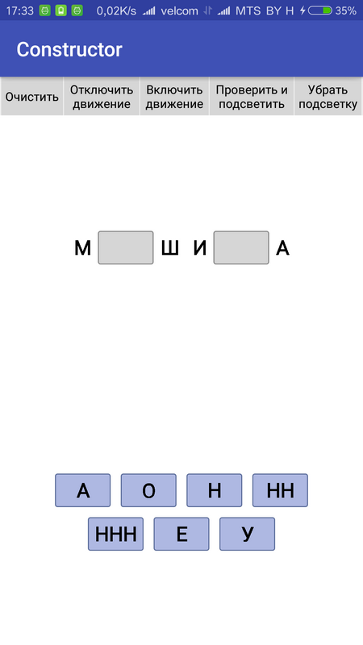
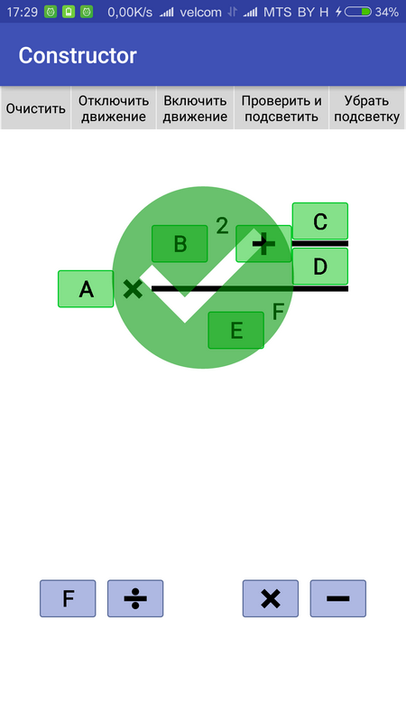
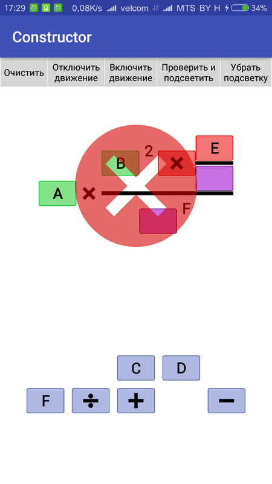

# FormulLib

[](https://oss.sonatype.org/content/repositories/releases/team/fastflow/kusu/constructor-formul/)

<a href="https://play.google.com/store/apps/details?id=team.fastflow.kusu.constructor.formul">
  
</a>

| Слово | Формула | Формула |
| --- | --- | --- |
|  |  |  |

## Начало

в **build.gradle**

```java
dependencies {
    compile 'team.fastflow.kusu:constructor-formul:1.0.5-BETA'
}
```

в **xml**

```java
	<team.fastflow.kusu.constructor.Views.Formul
		android:layout_width="match_parent"
		android:layout_height="match_parent"/>
```

===

проверить формулу

```java
 public Result getResult(boolean backlight, boolean movable, boolean clear, boolean check) 
 ```
 
 Возвращает текущее состояния формулы - сколько правильных/неправильных/незаполненных. Переменные отвечают:
 1. за подсветку правильных/неправильных ответов
 2. за возможность двигать блоки после результата
 3. очистить ли поле после результата
 4. показать ли большой знак результата

---

## Атрибуты у View

#### Маштабирование
```java
fs:min_scale format="float"
fs:max_scale format="float"
fs:autoscale format="boolean"
fs:autoscale_width format="boolean"
fs:movable_extrascale format="float"
```

Атрибуты отвечают за:

* 1. - 2. границы min max коэффициента маcштабирования на экране. 
* 3. автомаcштабирование
* 4. автомаcштабирование ширины блока по внутреннему контенту (ширина двигаемых и изменяемых блоков вычисляется по самому длинному тексту)
* 5. увеличение блока при перемещении

===

#### Размеры
```java
fs:block_size format="dimension"
fs:block_factor format="float"
fs:percent format="float"
fs:height format="dimension"
fs:percent_height format="boolean"
fs:padding_factor format="float"
fs:text_percent format="float"
fs:division_factor format="float"
fs:division_padding_factor format="float"
fs:movable_divider_factor format="float"
fs:group_movables format="boolean"
fs:check_size format="float"
```

Атрибуты отвечают за:

* 1. стандартный размер блока для расчета (его высота)
* 2. коэффициент ширины стандартного блока (относителльно block_size)
* 3. - 5. расчет высоты части с формулой (относительно всей высоты View)
* 6. коэффициент отступов внтури поля (относителльно block_size)
* 7. коэффициент высоты текста (относителльно block_size)
* 8. - 9. коэффициенты высоты линии деления и ее отступов (относителльно block_size)
* 10. коэффициент свободного пространства между двигаемыми блоками (относителльно block_size)
* 11. группировку (по центру или растягивать на всю ширину)
* 12. коэффициет размера большого знака результата (относительно высоты части с формулой)

===

#### Цвета
```java
fs:background_color format="color"
fs:text_color format="color"
fs:division_color format="color"
```

Атрибуты отвечают за:

* 1. цвет фона
* 2. цвет текста
* 3. цвет линии деления

===

#### Drawables
```java
fs:default_block format="reference"
fs:changeable_block format="reference"
fs:movable_block format="reference"
fs:unselected_block format="reference"
fs:good_block format="reference"
fs:bad_block format="reference"
fs:plus_block format="reference"
fs:minus_block format="reference"
fs:equally_block format="reference"
fs:bkt_left_block format="reference"
fs:bkt_right_block format="reference"
fs:multiply_block format="reference"
fs:division_block format="reference"
fs:check_bad format="reference"
fs:check_good format="reference"
```

Атрибуты отвечают за:

* 1. - 3. фон блоков
* 4. - 6. фон подсветки блоков
* 7. - 13. изображения для символов
* 14. - 15. изображения больших знаков результата

---

## Работа с парсером формул

```java
    private char BLOCK_DEF = '@';
    private char CHANGEABLE_DEF = '&';
    private boolean seeMultiply = true;
    private boolean seeBrackets = false;
    private boolean seeSquareBrackets = false;
```

* Символ, который ограничивает область, берущуюся без изменений. **Например**, "@2/2@" преобразуется в блок со значение "2/2", а не в блок деления
* Символ, которым помечаются **Changable** блоки. Рабоает и внутри области выделенной, с помощью **BLOCK_DEF** 
* Отображать ли знак умножения (затрагивает только знаки вне области выделенной, с помощью **BLOCK_DEF**)
* Отображать ли круглые скобки (затрагивает только знаки вне области выделенной, с помощью **BLOCK_DEF**)
* Отображать ли квадратные скобки (затрагивает только знаки вне области выделенной, с помощью **BLOCK_DEF**)

---

## Типы Leaf

#### Nextable

Блок, отвечающий за постоянный символ. Единичный. В **list** лежит 1 элемент - следующий блок. В **symbols** лежит отображаемый текст.

===

#### Changable

Блок, отвечающий за изменяемый символ. Единичный. В **list** лежит 1 элемент - следующий блок. В **symbols** лежит правильный текст. Текст для отображения берется из **block** (в который помещается **Movable**)

===

#### Movable

Блок, отвечающий за двигаемый символ. Единичный. В **symbols** лежит отображаемый текст.

===

#### Power

Блок, отвечающий за степень. Не отображаемый. В **list** лежит:

1. следующий блок, который образует значение степени.
2. следующий блок, который образует значения после выхода из части со степенью.

===

#### Division

Блок, отвечающий за степень. Не отображаемый. В **list** лежит:

1. следующий блок, который образует значение числителя.
2. следующий блок, который образует значение знаменателя.
3. следующий блок, который образует значения после выхода из части с делением.

---

### Copyright (c) 2016 FastFlow team

Полный текст лицензии содержится в файле License.md
